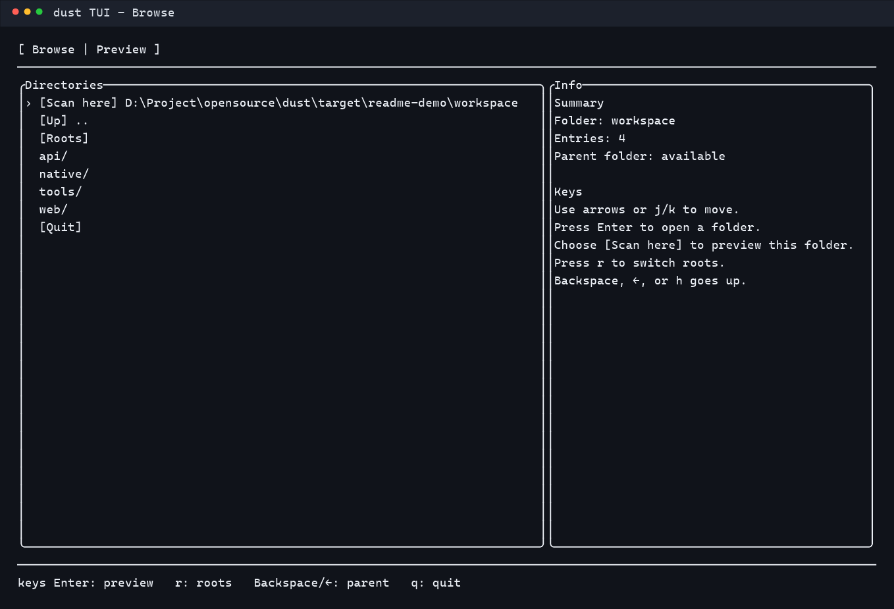
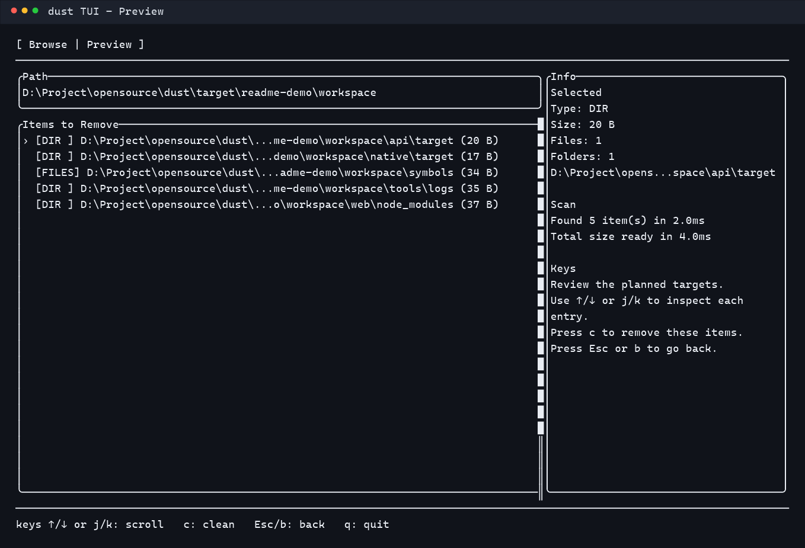

# dust

[English](./README.md) | [繁體中文](./README.zh-TW.md)

`dust` is a CLI tool that scans a directory and removes common build artifacts, cache folders, and generated binaries that should not be committed to version control.

It is designed for quickly cleaning large workspaces containing projects written in C#, Node.js, Rust, and Zig.

## Features

- Recursively scans a target directory
- Supports both command-line path input and an interactive TUI browser
- Supports a full-screen interactive TUI directory browser
- Shows all matched items before deletion
- Requires confirmation before removing anything
- Supports `--dry-run` for safe previewing
- Supports repeated `--exclude` glob filters to protect paths you do not want to touch
- Skips common metadata and protected folders by default for faster and safer scans, including `.git`, `.idea`, `.vscode`, `.venv`, `coverage`, `deploy`, and `rustdoc` generated documentation output
- Supports `--yes` for non-interactive cleanup
- Supports `--dirs-only` and `--files-only` scan modes
- Supports `--json` output for scripts and CI
- Supports `--check-updates` to check the latest GitHub Release version
- Checks for updates on startup and only shows a notice when a newer version is available; TUI mode shows the notice as an in-app modal with a self-update shortcut
- Supports `--quiet` to suppress normal console output
- Supports `--no-progress` to disable the delete progress bar
- Shows a real delete progress bar with percentage, current target, and current path summary
- Supports `--progress-style soft|minimal`
- Cleans common build folders and generated files across multiple languages

## Screenshots

Real TUI captures rendered from `dust` against a sample workspace.

### Browse mode



### Preview mode



## Supported Cleanup Targets

### Directories

- `bin`
- `obj`
- `node_modules`
- `target`
- `zig-cache`
- `.zig-cache`
- `zig-out`
- `log`
- `logs`

### Files

- `*.pdb`
- `*.ilk`
- `*.o`
- `*.obj`
- `*.so`
- `*.a`
- `*.lib`
- `*.dll`
- `*.exe`
- `*.wasm`

Generated binary files such as `*.exe`, `*.dll`, `*.so`, `*.a`, `*.lib`, and `*.wasm` are only removed when they are located under known build-output directories such as `target`, `bin`, `obj`, `zig-out`, `zig-cache`, or `.zig-cache`.

### Special handling for `log` and `logs`

- Only files ending in `.log` or `.txt` are removed
- The `log` or `logs` directory itself is removed only when no files remain inside it
- If the current scan root is itself named `log` or `logs`, it is also listed as a cleanup target when matching files are present

## Installation

### Prerequisites

Install Rust first if it is not already available on your machine:

```bash
https://rustup.rs
```

### Build from Source

```bash
git clone https://github.com/jiansoft/dust.git
cd dust
cargo build --release
```

### Add to PATH

```bash
cp target/release/dust ~/.cargo/bin/
```

## Build Scripts

This repository includes helper scripts for local builds:

- [build.sh](./build.sh) for Unix, Linux, and macOS
- [build.bat](./build.bat) for Windows
- [build-release-assets.ps1](./build-release-assets.ps1) for packaging GitHub Release assets

### Default build

Unix / macOS / Linux:

```bash
./build.sh
```

Windows:

```bat
build.bat
```

Both scripts build `dust` in `release` mode by default and verify that the output binary exists.

### Build with a different profile

Unix / macOS / Linux:

```bash
PROFILE=debug ./build.sh
```

Windows:

```bat
set PROFILE=debug
build.bat
```

### Build specific targets

Unix / macOS / Linux:

```bash
TARGETS="aarch64-unknown-linux-musl x86_64-unknown-linux-gnu" ./build.sh
```

Windows:

```bat
set TARGETS=aarch64-unknown-linux-musl x86_64-pc-windows-msvc
build.bat
```

When `TARGETS` is set, the scripts call `rustup target add` before building each target.

## Release Assets

Use [build-release-assets.ps1](./build-release-assets.ps1) to build and package upload-ready archives for GitHub Releases.

For non-Windows targets, the script uses `cargo zigbuild` with Zig instead of relying on the system `cc` linker.

### Default target matrix

By default, the script targets:

- `x86_64-pc-windows-msvc`
- `aarch64-pc-windows-msvc`
- `x86_64-unknown-linux-gnu`
- `aarch64-unknown-linux-gnu`
- `aarch64-apple-darwin`

Generated archive names follow this format:

- `dust-v<version>-windows-x86_64.zip`
- `dust-v<version>-linux-aarch64.tar.gz`
- `dust-v<version>-macos-aarch64.tar.gz`

### Build release assets

```powershell
.\build-release-assets.ps1
```

### Build selected targets only

```powershell
.\build-release-assets.ps1 -Targets x86_64-pc-windows-msvc,aarch64-apple-darwin
```

### Use environment variables

```powershell
$env:TARGETS = "x86_64-pc-windows-msvc aarch64-apple-darwin"
$env:PROFILE = "release"
.\build-release-assets.ps1
```

### Output

The script writes archives under `release-assets/` and stages per-target packaging contents in subfolders below it.

On Windows targets, the archive also includes `dust.pdb` when available.

### Requirements for Linux and macOS targets

If you build Linux or macOS targets locally, install these tools first:

```powershell
cargo install --locked cargo-zigbuild
pip install ziglang
```

## Usage

### Scan a specific path

```bash
dust D:\Project\MyApp
```

### Use interactive TUI

```bash
dust
```

When no path is provided, `dust` opens a full-screen TUI browser from the current working directory. Any startup update notice is shown as an in-app modal.

- Windows: you can start from available drives, the current directory, the home directory, or the last selected directory
- Unix/macOS: you can start from `/`, the current directory, the home directory, or the last selected directory
- Inside the TUI, browse directories, switch folders by shortcut or typed path, preview planned deletions, clean, or quit
- In the default interactive preview, `dust` focuses on directory-like targets; use `--files-only` if you want the preview to list grouped removable files instead

After each cleanup run, the TUI is shown again so you can continue working without restarting the tool.

### Preview without deleting

```bash
dust . --dry-run
```

### Skip confirmation

```bash
dust . --yes
```

### Exclude paths

```bash
dust . --exclude '**/vendor/**' --exclude '**/third_party/**'
```

### Remove directories only

```bash
dust . --dirs-only
```

### Remove files only

```bash
dust . --files-only
```

### JSON output

```bash
dust . --dry-run --json
```

### Check for updates

```bash
dust --check-updates
dust --check-updates --json
```

When the TUI update modal appears, press `u` to download the matching GitHub Release archive and schedule the current binary to be replaced after `dust` exits. Press `Enter` to open the release page instead.

### Quiet mode

```bash
dust . --yes --quiet
```

### Disable progress bar

```bash
dust . --yes --no-progress
```

### Progress style

```bash
dust . --yes --progress-style soft
dust . --yes --progress-style minimal
```

`soft` is heavier and more descriptive. `minimal` is lighter and quieter.

After scanning, `dust` prints the folders and files that will be removed. By default it asks for confirmation before deletion.

## Typical Use Cases

- Clean mixed-language monorepos before archiving or sharing
- Remove local build artifacts before checking git status
- Reclaim disk space in development workspaces

## License

MIT
